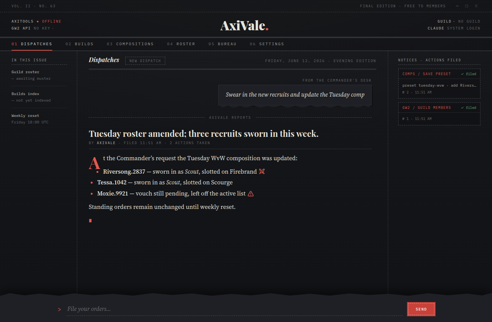
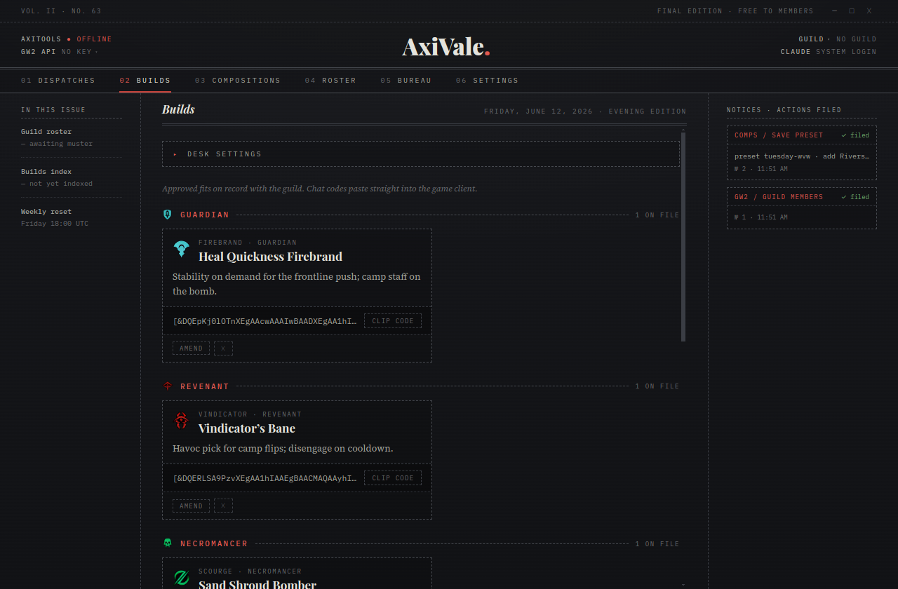

<p align="center">
  
</p>

<h1 align="center">AxiVale<span>.</span></h1>

<p align="center">
  <b>A virtual officer for your Guild Wars 2 guild and Discord.</b><br/>
  Chat with an agent that actually runs your guild — builds, comps, roster,
  Discord management, audits, announcements — styled as a dark-newsprint broadsheet.
</p>

<p align="center">
  <a href="https://github.com/darkharasho/axivale/actions/workflows/ci.yml"></a>
  <a href="https://github.com/darkharasho/axivale/releases/latest"></a>
  <a href="https://github.com/darkharasho/axivale/releases"></a>
</p>

<p align="center">
  
</p>

<p align="center">
  
</p>

## What it does

You file orders in plain English — *"who joined this week?"*, *"add the
MetaBattle feed to #news"*, *"DM everyone without an API key and remind them
to link one"* — and AxiVale (a Claude agent with real tools) does the work:

- **Guild intelligence** — roster, join history, and activity through the
  official GW2 API; any `/v2` endpoint on demand (items, prices, WvW matches).
- **Builds & compositions** — full CRUD on the [AxiTools](https://github.com/darkharasho/axitools)
  bot's builds and squad-comp presets/schedules, shared with its Discord slash
  commands.
- **Discord management** — channels, roles, members, messages, threads,
  events, and DMs via a guild-scoped action registry. Destructive actions
  (deletes, kicks, bans, mass DMs) always show a **Notice of Destruction**
  you approve first.
- **The Bureau** — audit log queries, RSS feeds, Twitch/YouTube stream
  announcements, WvW alliance settings, and GW2-guild→role mappings.
- **Management panels** — Builds, Compositions, Roster (searchable), and
  Bureau desks when you'd rather click than ask.

Replies render as newspaper articles (full markdown, emoji set as engraved
icons); every tool call files a receipt in the Notices rail.

## Install

Grab the latest release for your platform from
[**Releases**](https://github.com/darkharasho/axivale/releases) —
Linux AppImage, Windows installer, or macOS DMG (signed + notarized).
The app updates itself from the release feed.

## Setup

Three credentials, all stored encrypted with the OS keychain:

1. **AxiVale key** — in your Discord server (with the AxiTools bot installed),
   run `/config apikey generate` (requires *Manage Server*) and paste the
   `axt1.…` key into **Settings → AxiTools**. The key carries the bot's
   address and binds the app to that server — no URLs to configure. Save one
   key per server and switch from the masthead.
2. **GW2 API key** — create at
   [account.arena.net/applications](https://account.arena.net/applications)
   with `account` + `guilds` scopes; paste into **Settings → GW2 API keys**.
   Multiple accounts supported.
3. **Claude** — leave empty to use this machine's Claude Code login, or run
   `claude setup-token` and paste the token. Pick a model (Haiku/Sonnet/Opus)
   if you don't want the default.

Then open **01 · Dispatches** and file your orders.

## Hosting the bot side

AxiVale talks to your [AxiTools](https://github.com/darkharasho/axitools)
instance. Same machine works out of the box; for guildmates on other networks,
put the bot's API behind a Cloudflare Tunnel and set `AXITOOLS_PUBLIC_URL` —
see the AxiTools README for the recipe. Per-server keys are scoped by the bot
(a key for one Discord server cannot touch another), and the legacy global
token is disabled by default.

## Development

```bash
npm install        # needs ../gw2-class-icons checked out as a sibling
                   # also needs ../axiforge (file: dep on @axiapps/forge-render)
                   # and ../axibridge (file: dep on @axiapps/bridge-metrics)
npm run dev        # electron-vite with HMR
npm test           # vitest (capped at 2 workers)
npm run typecheck  # tsc, main + renderer projects
npm run dist       # package for the current platform (release/)
```

CI runs typecheck/tests/build on every push. Releases are tag-driven:

```bash
npm version minor && git push --follow-tags
```

GitHub Actions builds Linux/Windows/macOS, signs + notarizes the mac build,
and publishes to Releases — installed apps pick the update up automatically.

## Architecture

- **Main process** hosts the Claude Agent SDK; the officer toolset is an
  in-process MCP server. Destructive tools are excluded from `allowedTools`
  so they route through a `canUseTool` confirm gate wired to the renderer.
- **AxiTools HTTP API** (in the bot): aiohttp over the bot's own storage —
  the app and the Discord slash commands share one source of truth. Auth is
  per-server hashed keys; every route is guild-scoped server-side.
- **Renderer**: React, no state library; agent events stream over IPC and
  fold into the article for the active turn. Conversation persists locally.

Design docs live in `docs/superpowers/specs/` (including the approved UI
mock) and screenshots regenerate with `node scripts/take-screenshots.mjs`.
